<h1 align="center">
  
</h1>

<h3 align="center">
  Semana OmniStack 11
</h3>

## Sobre o projeto

Be the Hero é uma aplicação para ONG's que necessitam de ajuda para o tratamento de animais. Desenvolvido ultilizando as tecnologias
<b>NodeJs no backend, ReactJs no frontend e React-Native no mobile.</b><br />
A aplicação WEB, foi desenvolvida para as ONG's, onde a mesma pode lidar com cadastros dos casos. <br />
A aplicação mobile foi desenvolvida para o <b>Heróis</b> que desejam contribuir para o tratamento desse animais. Ele escolhe um caso e entra em contato
com a ONG para poder ser o Herói daquele caso.
<br /><br />
## Demonstração

Detalhes das aplicações.
<b>Dark mode <3</b>

<br/>

Caso queira testar as aplicações, siga com as configurações abaixo.

## Configuração
<br/><br/>
Clone o repositório.

```
git clone https://github.com/jmnsingle/SemanaOmnistack11
```

<br />

### Instruções para o backend

Vá para a pasta root e instale as dependencias:

```
cd SemanaOmnistack11/backend/
yarn
```
E então, basta digitar o comando abaixo para iniciar o backend:

```
yarn dev
```

Você pode baixar o <a href= "https=//insomnia.rest/">Insomnia</a> para testar a aplicação.

<br />

### Instruções para o Frontend

Vá para a pasta root e instale as dependencias:

```
cd SemanaOmnistack11/frontend/
yarn
```
Iniciando o frontend:

```
yarn start
```

<br />

### Instruções para o mobile.

Vá para a pasta root e instale as dependencias:

```
cd SemanaOmnistack11/mobile/
yarn
```

Acesse o arquivo `api.js` na pasta `src/services` e altere o IP para o IP da sua máquina.

Então, inicie a aplicação:

```
react-native run-android
```

## Imagens

### Web

<p float="left">
  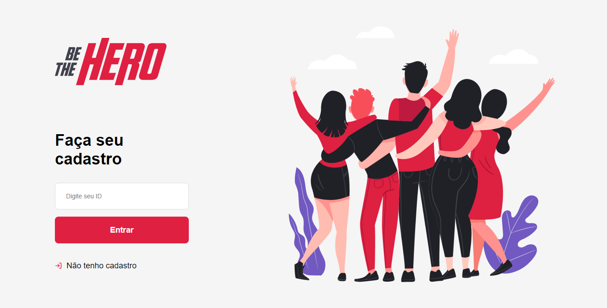
  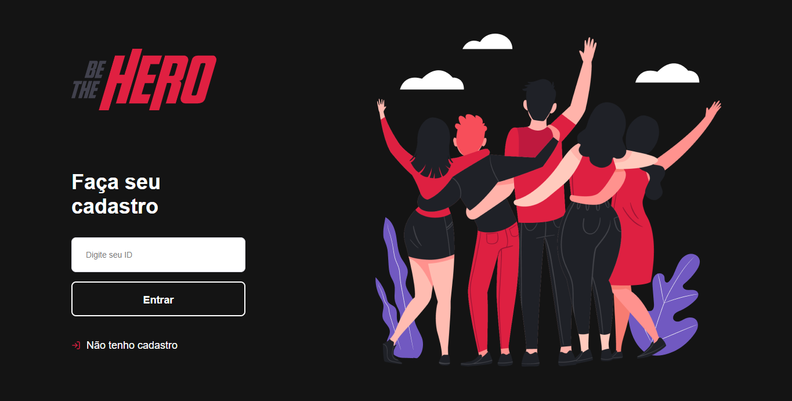
  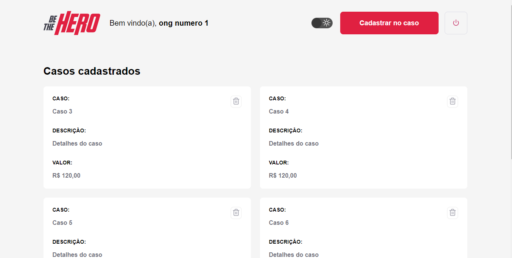
  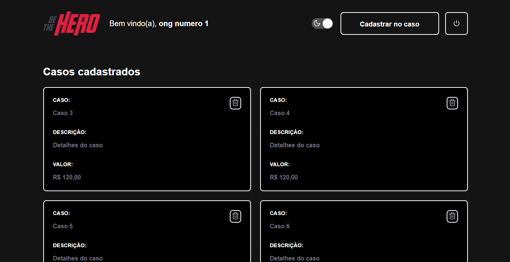
  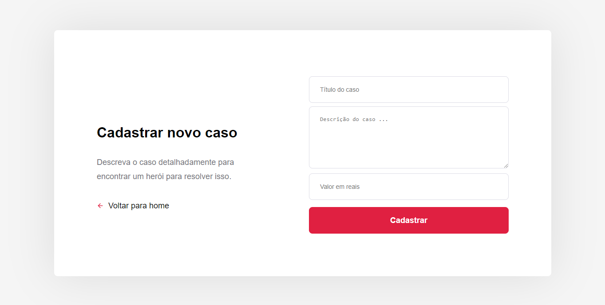
  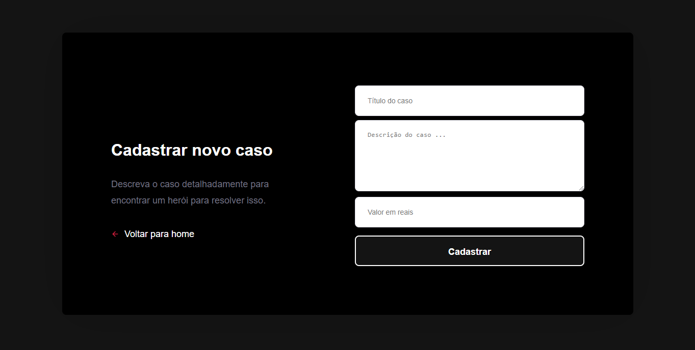
  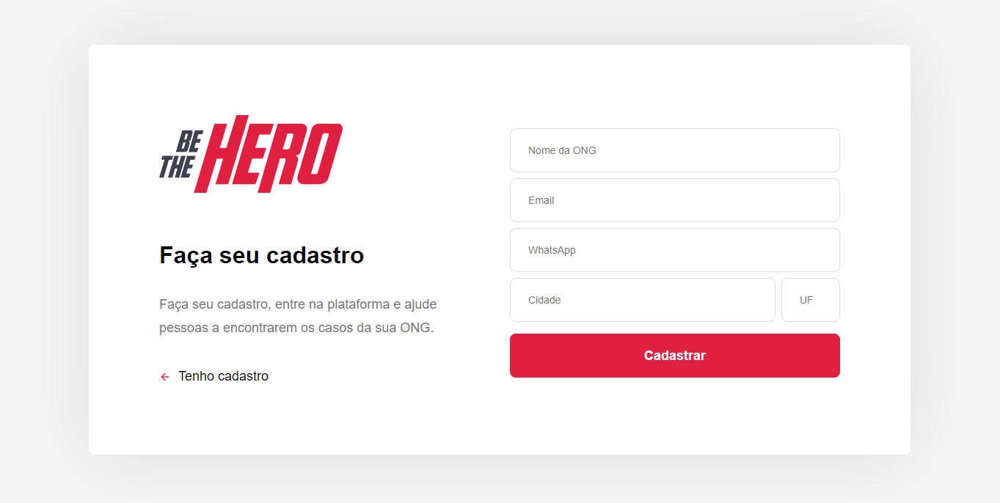
  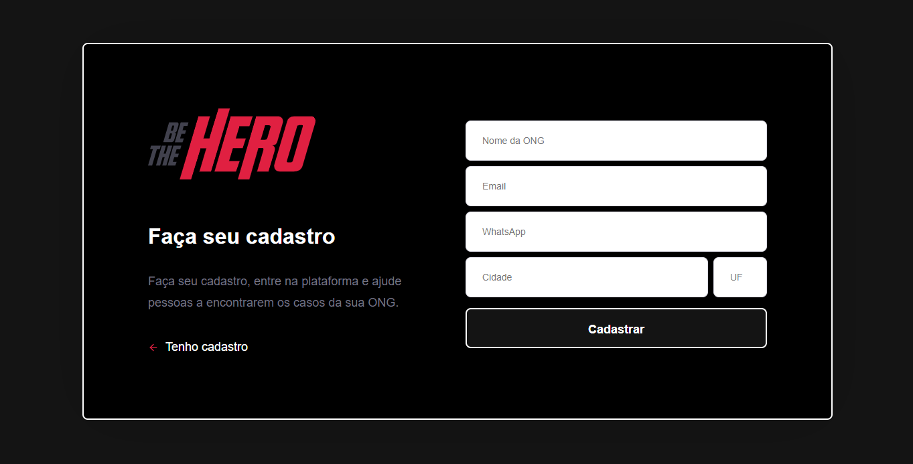
</p>

### Mobile

<p float="left">
  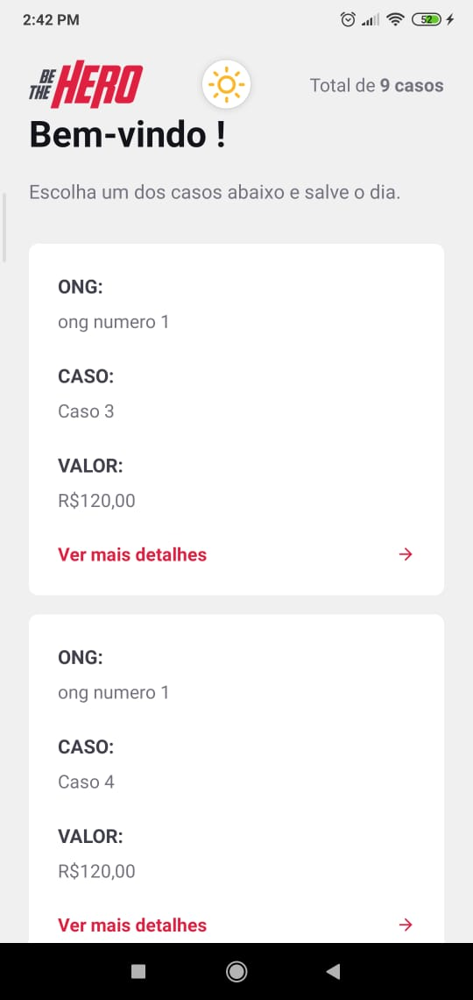
  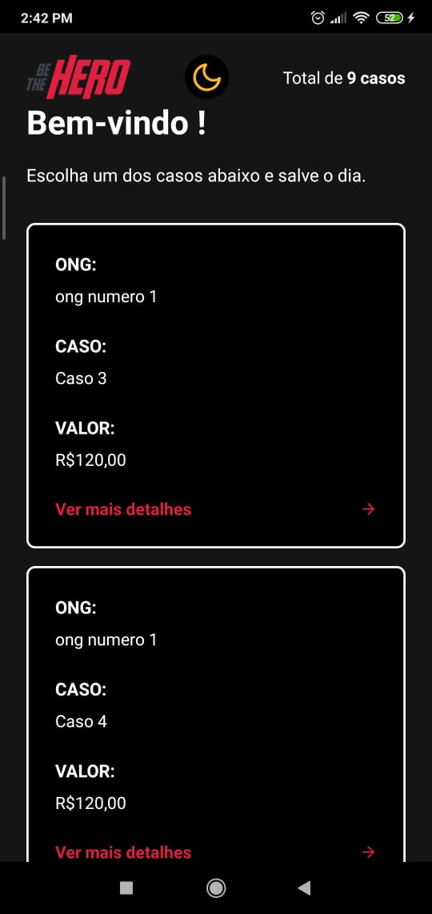
  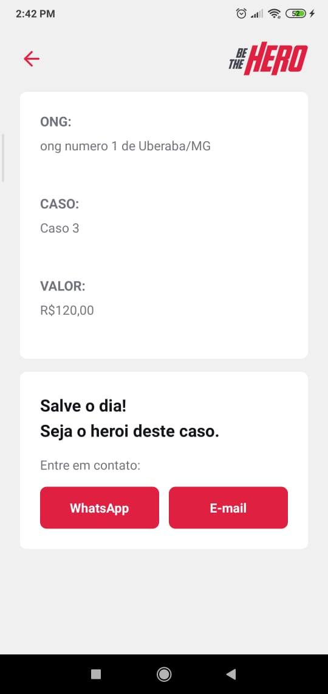
  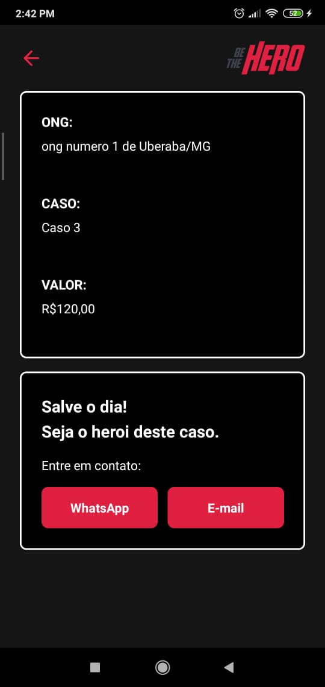
</p>
